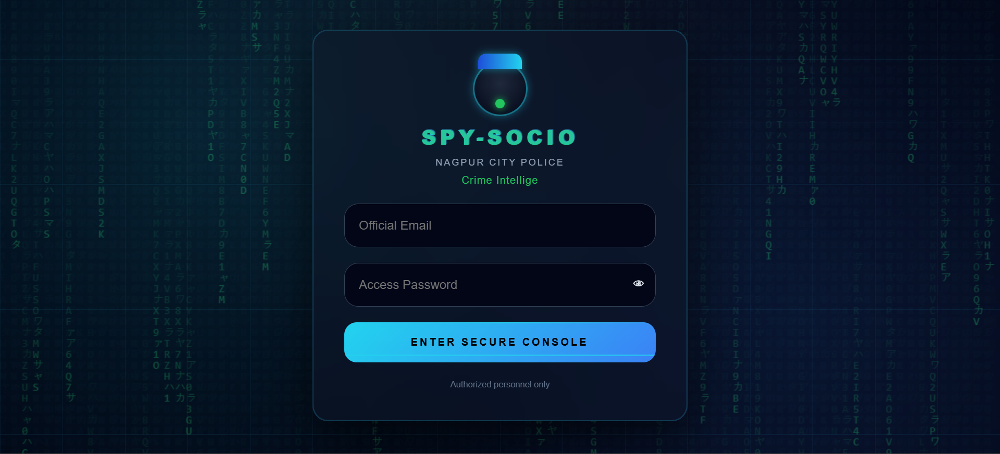
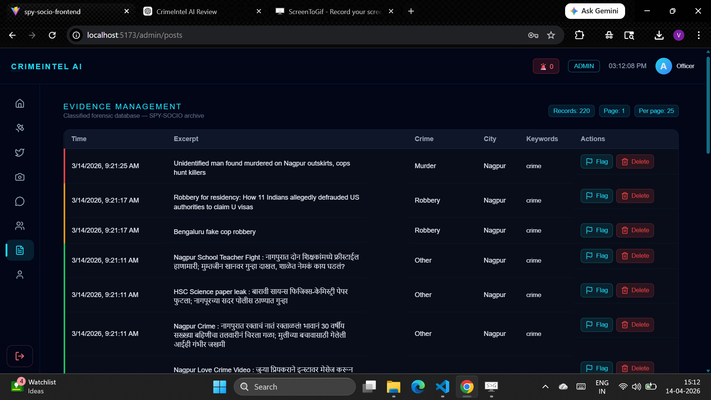
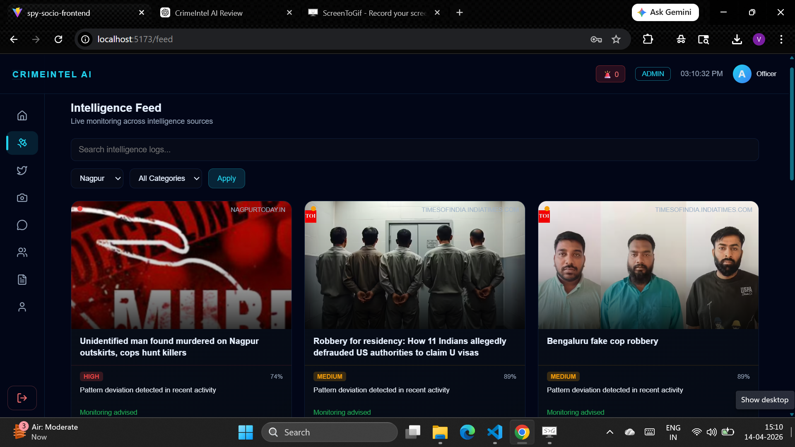
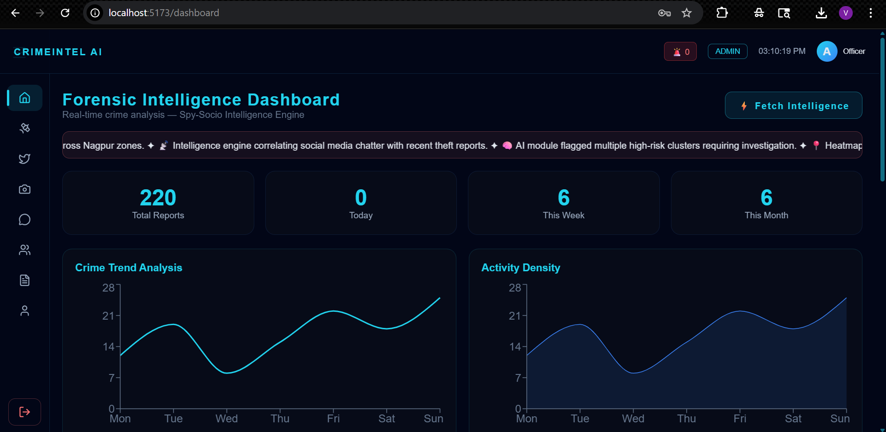

<h1 align="center">CrimeIntel AI</h1>

> Real-time intelligence dashboard for monitoring crime related activity using aggregated data from news and social media sources.

---

## Preview


---

## Screenshots

### Login


### Admin Panel


### Intelligence Feed


### Dashboard


---

## Live Demo

* Frontend: https://your-vercel-link.vercel.app
* Backend API: https://your-render-link.onrender.com

---

## What is CrimeIntel AI?

CrimeIntel AI is a fullstack intelligence platform that collects and visualizes crime related data from multiple sources including:

* News scraping
* Reddit discussions
* Twitter posts
* Social media content

The system processes this data and presents it through an interactive dashboard with **real-time updates and geospatial visualization**.

---

## Key Highlights

* Real time alerts using Socket.IO
* Crime heatmaps with Leaflet
* Interactive analytics dashboard
* Multi source data aggregation
* Role-based authentication (Admin / Officer)
* Modular full-stack architecture

---

## Tech Stack

### Frontend

* React + Vite
* Tailwind CSS
* Framer Motion
* Leaflet

### Backend

* Node.js
* Express.js
* MongoDB
* Socket.IO

---

## Project Structure

```
crimeintel-ai/
├── backend/
├── frontend/
├── eda/
```

---

## Quick Start

```bash
# Clone repository
git clone https://github.com/vipultechstack/crimeintel-ai.git

# Backend
cd backend
npm install
npm run dev

# Frontend
cd ../frontend
npm install
npm run dev
```

---

## System Architecture

CrimeIntel AI follows a modular full-stack architecture with real-time data flow.

### Data Flow

```
Data Sources (News, Reddit, Twitter, Social Media)
        ↓
Ingestion Layer (Scrapers / Workers)
        ↓
Processing Layer (Services)
        ↓
MongoDB Database
        ↓
REST APIs + Socket.IO Events
        ↓
Frontend Dashboard (React)
```

---

### Backend Architecture

* Modular structure (auth, crime, post, social)
* Service layer for business logic
* Worker-based ingestion for social platforms
* REST APIs for data access
* Socket.IO for real-time updates

---

### Frontend Architecture

* Feature-based structure (auth, dashboard, intelligence)
* Shared UI component system
* Centralized API handling
* Real-time updates via WebSockets

---

## Why This Project?

Most dashboards only visualize static data.

CrimeIntel AI focuses on:

* Aggregating real-time data from multiple sources
* Monitoring social signals for crime-related activity
* Visualizing insights with geospatial context
* Delivering live updates through real-time communication

This project is designed to reflect how modern intelligence systems aggregate, process, and visualize real-time data streams.

---

## Challenges & Solutions

### 1. Handling Multiple Data Sources

* **Challenge:** Integrating data from news, Reddit, Twitter, and social feeds
* **Solution:** Created modular ingestion services and workers for each source

---

### 2. Real-Time Updates

* **Challenge:** Keeping dashboard data updated without refresh
* **Solution:** Implemented Socket.IO for live event updates

---

### 3. Data Consistency

* **Challenge:** Managing different data formats from multiple sources
* **Solution:** Standardized processing layer before storing in MongoDB

---

### 4. Scalable Structure

* **Challenge:** Avoiding tightly coupled code
* **Solution:** Used modular architecture with service-based separation

---

## Exploratory Data Analysis (EDA)

The project includes exploratory analysis of crime-related datasets to understand patterns and trends.

* Data cleaning and preprocessing
* Pattern identification
* Insight generation for dashboard design

---

## Use Cases

- Law enforcement monitoring and analysis  
- Social media intelligence tracking  
- Crime trend analysis and visualization  
- Real-time alert systems for critical events  

---

## Future Improvements

* Event-driven architecture using message queues (Redis, BullMQ)
* NLP-based classification of crime-related content
* Geo-clustering for hotspot detection
* Advanced filtering and search capabilities
* Notification center with priority alerts

---

## Contact

If you're interested in collaboration, freelance work, or discussing opportunities:

- GitHub: https://github.com/vipultechstack  
- Email: vipulpaighan.1988@gmail.com  

---

## ⭐ Support

If you found this project useful, consider giving it a star ⭐
